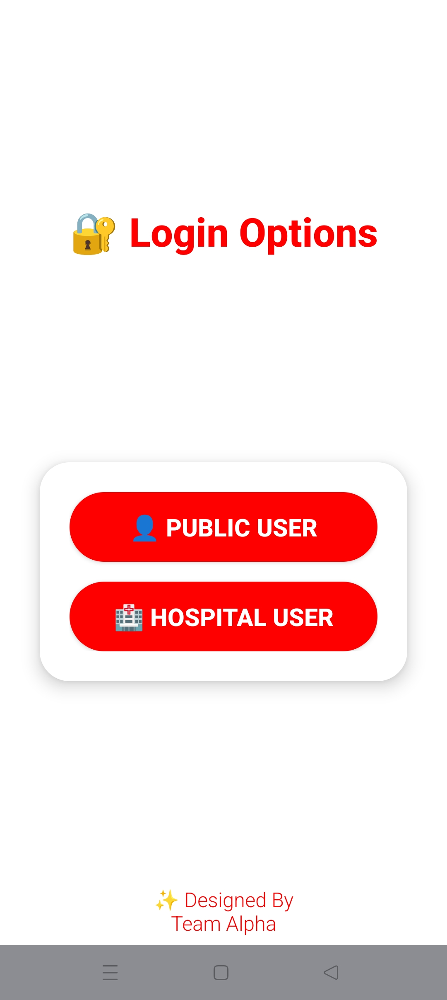
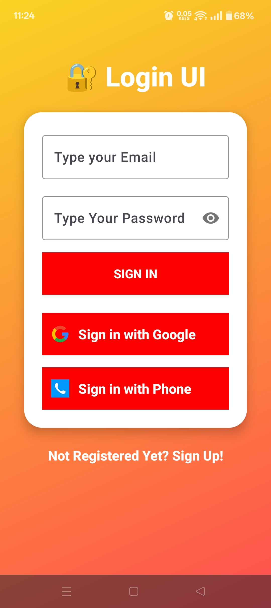
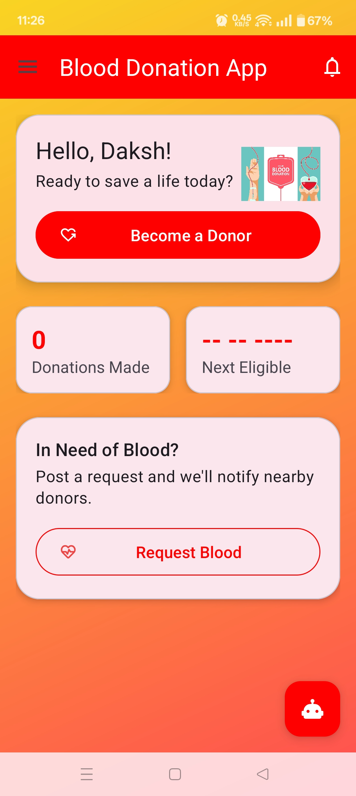

# 🩸 BloodBridge - Blood Donation App

<div align="center">

### ❤️ Connecting Donors. Saving Lives.

*A modern Android application that bridges the gap between blood donors, recipients, and hospitals through secure authentication, real-time communication, and cloud-based services.*


</div>

---

# 📑 Table of Contents

* [📖 Overview](#-overview)
* [🎯 Objectives](#-objectives)
* [✨ Features](#-features)
* [📱 Screenshots](#-screenshots)
* [🛠 Tech Stack](#-tech-stack)
* [💻 Software Requirements](#-software-requirements)
* [📂 Project Structure](#-project-structure)
* [🚀 Future Scope](#-future-scope)

---

# 📖 Overview

BloodBridge is a modern Android application developed to simplify and digitize the blood donation process by connecting donors, recipients, and hospitals through a secure and user-friendly platform.

Traditional blood donation systems often depend on manual records, phone calls, and local donation drives, making it difficult to respond quickly during emergencies. BloodBridge addresses these challenges by leveraging **Kotlin**, **Firebase**, and **Google Maps** to provide real-time communication, cloud-based data storage, and efficient donor management.

The application enables users to register securely, donate blood, request blood during emergencies, maintain donation history, receive instant notifications, and locate suitable donors based on blood group and location. Hospitals can securely manage donor information, verify accounts, publish emergency blood requests, and provide medical reports directly to donors.

Designed with simplicity, reliability, and accessibility in mind, BloodBridge aims to make blood donation faster, more organized, and readily available whenever lives depend on it.

---

# 🎯 Objectives

### 👤 Public User

* 🔐 Authenticate using Email, Google, or Phone Number.
* ❤️ Register as a blood donor.
* 🩸 Request blood during emergencies.
* 📅 View donation history and previous donation records.
* ⏳ Track the next eligible blood donation date.
* 🤖 Access an AI-powered chatbot for instant guidance.
* 📄 View medical reports uploaded by hospitals.

### 🏥 Hospital User

* 🏥 Secure authentication using verified hospital email.
* 🚨 Publish Emergency SOS blood requests.
* 📝 Maintain donor records including age, health details, and screening reports.
* 📄 Upload donation reports accessible by donors.
* ☁ Manage donor information securely using Firebase.

### 🌍 Overall Goals

* 🎨 Deliver a clean and intuitive user interface.
* ⚡ Improve emergency response time.
* 🔒 Ensure secure cloud-based data management.
* 📱 Provide a smooth and reliable Android experience.

---

# ✨ Features

| Feature                    | Description                                                 |
| -------------------------- | ----------------------------------------------------------- |
| 🔐 Multi-Authentication    | Login using Email, Google, or Phone Authentication          |
| ❤️ Blood Donation          | Register as a donor and manage donation records             |
| 🩸 Blood Request           | Search and request blood during emergencies                 |
| 🏥 Hospital Dashboard      | Dedicated interface for hospitals                           |
| 🚨 Emergency SOS           | Hospitals can instantly notify eligible donors              |
| 🤖 AI Chatbot              | Provides guidance and answers common queries                |
| 📍 Google Maps Integration | Locate nearby donors efficiently                            |
| 📄 Medical Reports         | Hospitals upload donor reports accessible through the app   |
| ☁ Firebase Integration     | Secure Authentication, Realtime Database, and Cloud Storage |
| 🔔 Real-Time Updates       | Instant synchronization across all users                    |
| 📊 Donation History        | Maintain complete donation records                          |
| 🎨 Material Design UI      | Modern and responsive Android interface                     |

---

# 📱 Screenshots

> Place all screenshots inside the **screenshots/** folder.
<p align="center">
  
  
  
 
</p>

---

# 🛠 Tech Stack

| Category                | Technologies                    |
| ----------------------- | ------------------------------- |
| 📱 Programming Language | Kotlin                          |
| 🎨 UI Design            | XML, Material Design Components |
| ☁ Backend               | Firebase                        |
| 🔐 Authentication       | Firebase Authentication         |
| 🗄 Database             | Firebase Realtime Database      |
| 📁 Storage              | Firebase Storage                |
| 🗺 Maps                 | Google Maps SDK                 |
| 📡 APIs                 | Google Play Services            |
| 🖥 IDE                  | Android Studio                  |
| ⚙ Build Tool            | Gradle                          |
| 🧪 Testing              | Android Emulator                |

---

# 💻 Software Requirements

| Component            | Requirement                                 |
| -------------------- | ------------------------------------------- |
| Operating System     | Windows 10/11, Linux (Ubuntu), or macOS     |
| IDE                  | Android Studio (Latest Stable Version)      |
| Programming Language | Kotlin                                      |
| Database             | Firebase Realtime Database                  |
| Authentication       | Firebase Authentication                     |
| Storage              | Firebase Storage                            |
| SDKs                 | Android SDK, Firebase SDKs                  |
| APIs                 | Google Maps API, Google Play Services       |
| UI Library           | Material Design Components                  |
| Image Loading        | Glide / Picasso                             |
| Networking           | Retrofit / Volley (Optional)                |
| Build Tool           | Gradle                                      |
| Testing              | Android Emulator or Physical Android Device |

---

# 📂 Project Structure

```text
BloodBridge
│
├── app/
│   ├── src/
│   ├── java/
│   ├── res/
│   ├── manifests/
│
├── screenshots/
│   ├── login.png
│   ├── signup.png
│   ├── dashboard.png
│   ├── donate.png
│   ├── request.png
│   ├── emergency.png
│   ├── chatbot.png
│   └── profile.png
│
├── assets/
│   └── banner.png
│
├── gradle/
├── .gradle/
├── build.gradle.kts
├── settings.gradle.kts
├── gradle.properties
├── local.properties
├── README.md
└── LICENSE
```

---

# 🚀 Future Scope

Although BloodBridge successfully fulfills its primary objectives, several advanced features can further improve its effectiveness and real-world usability.

### 📍 Real-Time Donor Tracking

Integrate advanced Google Maps APIs to enable hospitals to track donors who accept emergency requests, ensuring faster arrival and optimized travel routes.

### 💬 In-App Communication

Provide secure chat and voice calling between hospitals and donors for better coordination during emergencies.

### 🤖 AI-Based Donor Recommendation

Use artificial intelligence to recommend the most suitable donors based on blood type, location, donation history, and eligibility.

### 🔔 Smart Push Notifications

Deliver personalized notifications based on donor eligibility, nearby emergencies, and upcoming donation schedules.

### 📅 Appointment Scheduling

Allow donors to schedule blood donation appointments with nearby hospitals or blood banks.

### 🌐 Multi-Language Support

Expand accessibility by supporting multiple regional and international languages.

### 📊 Blood Inventory Management

Enable hospitals to manage blood stock levels and availability directly within the application.

### ⌚ Wearable Device Integration

Support wearable devices for health monitoring and donor reminders.

### 📈 Analytics Dashboard

Provide hospitals with visual insights into donation trends, donor activity, and blood demand.

### ☁ Enhanced Security

Implement advanced encryption, role-based access control, and regular security audits to protect sensitive healthcare information.
